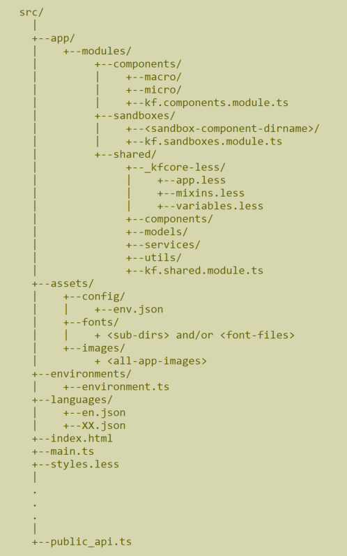

# Module Library Project kfhub_(module)_lib

This is the kfhub Module library project that hosts all the shareable components that are specific to the module. A module can be for Talent Architect (tarc), Talent Acquisition (tacq), Organization performance (orgp) or the Configuration/Administration App (conf)

>__NOTE:__ If you are new to the project, you may wish to go through the **README.md** of the kfhub_app Project first if you haven't done it already.

## Output of the project

The output of this project is a library file that follows the [Angular Package Format](https://docs.google.com/document/d/1CZC2rcpxffTDfRDs6p1cfbmKNLA6x5O-NtkJglDaBVs/preview).

The library produced by this project will contain the Components, Services, Models etc available for other projects to consume in the
kfhub_(module)_lib namespace

For example, for the Talent Architect Module, the components, services and models will be available in the kfhub_tarc_lib namespace

## kfhub_lib livereload

* Start `kfhub_lib` as usual
* Run `npm run start:ll`

## Naming Conventions

This library project as well as other library projects in the kfhub library suite in this redesign follow a certain naming convention for the
class names, file names, template names etc in terms of the prefixes they use. The following table lists the naming conventions for the kfhub_lib
Library Project. To see the naming conventions for the other projects in this suite, please visit the **README.md** for that project:

Type | Naming Convention | Example | Comments
---- | ----------------- | ------- | --------
General File Names | Use dashes to separate multiple words | jd-search | instead of jdSearch or jdsearch or jssrch
Type Script File | Prefix with 'kf(module)-', for the tarc module it would be 'kftarc.' | kftarc-jd-search.component.ts
Corresponding less File | Should have the same name as the .ts file | kftarc-jd-search.component.less
Corresponding template File | Should have the same name as the .ts file | kftarc-jd-search.component.html
Class Name | Prefix with 'KF(Module)'. For the tarc module it will be 'KfTarc' | KfTarcJDSearch | The class name is the CamelCased version of the file name
Component Selector | Prefix with 'kf(module)-'. For the tarc module it will be 'kftarc-' | selector: 'kftarc-jd-search' | This is the tag that corrsponds to this component as defined in the @Component(...) decorator of the component. Check for it inside the .ts file. Not all components need have this, but it is ok to add one though
Directory Name | Prefix with 'kf(module)-'. For the tarc module it will be 'kftarc-' | kftarc-jd-search | This is the name of the directory that hosts the .ts, .less and .html file corresponding to this component. Every component must be within its own directory. There may be some components with multiple .ts files in the same directory, but this would be when a component inherits its class from another but reuses the parent's template.
Service File Names | Prefix with 'kf(module)-' and suffix with '.service.ts'. For the tarc module the prfix will be 'kftarc-' | kftarc-job-description.service.ts
Service Class Names | Prefix with 'Kf(Module)'. For the tarc module it will be 'KfTarc' | KfTarcJobDescriptionService | The name will be the CamelCased version of the file name
Model File Names | Prefix with 'kf(module)-' and suffix with '.nodel.ts'. For the tarc module it will be 'kftarc-' | kftarc-sample.model.ts
Modle Class Names | Prefix with 'Kf(Module)'. For the tarc module it will be 'KfTarc' | KfTarcSample | Models will typically be Interfaces unless they require to contain logic such as for marshalling/unmarshalling in them

## File and Directory Organization

There are many files and directories that you would find in the kfhub_(module)_lib project. The following screenshot shows some of the more important files of this library that a developer is likely to modify at some point in the project. Depending on when you visit this **README.md** file, things may have changed from what is shown in the
screenshot below, if this **README.md** has not been kept up to date.



**The following table goes over some of these files:**

Directory or File | Comments
----------------- | --------
src/app/module/components/ | This is the root directory for all application level components. This has sub-directories micro/ and macro/
src/app/module/components/micro | The micro/ sub-directory contains shareable components that are ATOMIC. They should not be composed of other components
src/app/module/components/macro | The micro/ sub-directory contains shareable components that are composed of other micro components in the kfhub_lib project
src/app/module/sandboxes | This is the root directory for all the sandbox components that you build. Sandbox components allow you to test the shareable components that you create in isolcation. The Sandbox Components themselves will never be shared outside of this project
src/app/modules/shared | This is the root directory for all the core components, modules, services, models etc.
**/kf.XXX.module.ts | These are the files such as kf.components.module.ts under the components/, sandboxes/, shared/ directories. They declare the components that are part of the module and also import other components, modules and services they rely on as well as export the relevant components that this module exposes to the outside.
**src/app/shared/_kfcore-less** | This is an important shared directory, that hosts the common less files. It will ideally only contain the three files, mixins.less that contains all the common application level mixin functions, the variables.less that contains all the common application level less variables and the app.less which imports the mixins and variables. __All .less files of all components are required to import the common app.less from this directory. **THESE LESS FILES WILL BE ADDED, REMOVED OR UPDATED** only in the main shell project kfhub_app and not in this project. The changes will be synced by executing an npm sync command. Please see further details on this further down in the document.
assets/config, assets/fonts, assets/images | These are the static assets of the project. **NONE OF THE ASSETS WILL BE ADDED, REMOVED OR UPDATED** in the kfhub_lib or other 'module' library projects, but instead these actions will be performed in the main shell project kfhub_app and be synced with the library projects via an npm sync command. Please see more details of this further down in this document
assets/config/env.json | This is the Environment file that will host all the application configurable items and the values in the file be tailored to the deployed environment in the file that is delployed on the server for the environment (Equivalent of the talent-architect.config from the Angular 1 version of the kfhub app)
environments/environment.ts | This is a modified version of the OOB angular 2 environment reader that was customized to read the assets/config/env.json file
languages/en.json | This is the language specific translations file where the keys and values for the translations will be stored. This is the equivalent of the same from the Angular 1 version of the kfhub app. This is a customzation done for this project inorder to maintain and reuse the translation files as we are used to performing in the Angular 1 version of the kfhub app
index.html | This is the main html file which is the entry point for the app. No customizations have been made on this other than using the '/app' prefix as the base-href path
main.ts | This is the Main type script file that the angular CLI injects into the index.html
styles.less | This is the common styles files that hosts the application wide styles. This will not be used for this project other than to host the Reset CSS
public_api.ts | This is the file that lists all the components, services, models etc that will get exported in the kfhub_library when the npm command to build the library is invoked. Please see details of this further down in this document

## The Common Shared Less folder of the framework - _kfcore-less

This is the common less files for the entire project which consists of all the common mixins that are needed defined in the mixins.less file and all the variables that are needed defined in the variables.less file. Both of these files are referred to in the app.less and hence it is easy to import them both by simply importing app.less. All less files of all components must import the _kfcore-less/app.less file at the top of the file to ensure that the global mixins and variables are available to them during development time. During compile time, webpack will perform the necessary variable and mixing substitutions and make them part of the compiled source. See an example below:

``` less
// The following is the macro component in this kfhub_lib project that imports the _kfcore-less/app.less file:
//     src/app/modules/components/micro/market-insight/kftarc.market-insight-raw.component.less

@import 'node_modules/@kf-products-core/kfhub_lib/src/_kfcore-less
/app';

// Relative paths are used to import the app.less file
```

>NOTE: All less file modifications (as well as that of asset files and language files) must be done on the kfhub_app project and not in the kfhub_lib or in the kfhub_(module)_lib projects. You can sync the changes from the kfhub_app to the kfhub_lib app by running the following npm command

``` bash
# The following command will sync any changes that you make to the common less files
# in the src/app/modules/shared/_kfcore-less/*.less, src/styles.less as well as
# changes to the src/assets/**/* and src/languages/*

npm run sync

# The following is another way to ensure that the kfhub_lib project stays in sync with the changes
# you make to the kfhub_app project for the less, assets or languages.
# This is to start serving the kfhub_lib application with the following npm command
# instead of the typical 'npm start' command
# This way a background process will watch for any changes to the less, assets and languages
# in the kfhub_app project

npm run start:dev
```

## @{app-url-prefix} variables in .less files

The angular 5 application has been customized to run at the '/app' context rather than at the root '/' and hence all asset access must be prefixed with this. For flexibility and developer convenience, a less variable @{app-url-prefix} has been defined in the common less file that must be added in front of all asset URIs in the less files of components.

``` less
// The following is a sample less snippet that imports the 'oval-7.svg' image inside a less style
// The url(...) function makes use of the #{app-url-prefix} when referring to the 'oval-7.svg' image

.kf-glp-grade {
    display: inline-block;
    width: 44%;
    background: url("@{app-url-prefix}/assets/images/oval-7.svg");
    background-repeat: no-repeat;
    height: 70px;
    vertical-align: middle;
    text-align: center;
    padding-top: 7%;
    letter-spacing: 2px;
    margin: 10px 10px;
    font-size: 30px;
    font-weight: 300;
}
```

## Assets

The assets in the framework consits of the config, fonts and images sub-directories. The src/assets/config/env.json is a JSON file that contains all the application configuration properties that is used by the application for the specific environment. The version of the application deployed on the server for each of the environments will have its own version of the env.json with the values of the properties customized for that environment.

## Languages

The languages folder consists of JSON files with the names such as en.json, de.json etc, which follows the [Locale Language Codes](https://www.science.co.il/language/Locale-codes.php) as defined under i18n.

## public_api.ts

This file is used by the ng-packager utility that packages and builds a library out of the kfhub_lib and kfhub_(module)\_lib projects. The actuall process of bulding the libraries is explain in the documentation for the kfhub_app (as well as that for the kfhub_(module)_lib projects as the process of creating and consuming the library is more relevant to those projects).

The components that you wish to expose in the library is typically added to the module definition for the module that the component is categorized under and the .ts file for the module is exported in the public_api.ts file. However when following this there are times when ng-packager uses a different name for the exported component by adding the θ (theta) character in front of the component name and another character as suffix. To avoid this, such components have been explicitly mentioned with the name that they should get exported under. An example from below would be the component 'KfExternalAppRouterComponent' where the 'as KfExternalAppRouterComponent' ensures that the exported name 'KfExternalAppRouterComponent' is preserved.

Besides the components, we need to export the other classes such as models and services that we wish to export out of this library to be consumed by the host application code. These are done by explicitly listing the source file names. In the example below, the KfLoginInfo, KfSessionInfo are examples of models being exported and the KfRouteService and KfAuthService are examples of services being exported.

``` typescript
export * from './src/app/modules/shared/kf-shared.module';
export * from './src/app/modules/components/kf-components.module';
export { KfExternalAppRouterComponent as KfExternalAppRouterComponent } from './src/app/modules/shared/components/external-router/kf-external-app-router.component';
...

export { KfLoginInfo } from './src/app/modules/shared/models/kf-login-info.model';
export { KfSessionInfo } from './src/app/modules/shared/models/kf-session-info.model';
export { KfUser } from './src/app/modules/shared/models/kf-user.model';
...

export { KfRoutesService } from './src/app/modules/shared/services/kf-routes.service';
export { KfAuthService } from './src/app/modules/shared/services/kf-auth.service';
...
```

## Handling Routing

Routing is handled in this framework through a delegated model, where core routing related code executes in the kfhub_app project and any routing that are specific to a kfhub_(module)_lib project is defined there. There is some basic routing that is defined in this kfhub_lib application as well. This is done in the src/app/modules/shared/services/kf(module)-routes.service.ts File (For the tarc module this file willbe kftarc-routes.service.ts). The following is a sample from the kftarc-routes.services.ts from the tarc module

``` typescript
/*
 * Routing is defined by adding routes to a variable of type Route[] and by providing the path as well as the component to Route to.
 * The canActivate attribute of the Route definition allows you to pass one or more AuthGuards. Currently two AuthGuards have been defined.
 * The AuthGuard performs the authentication to ensure that a user is currently logged in before gaining access to the resource
 * The ProductAuthGuard performs authorization to ensure that the user has access to the specific resource based on his login permissions
 * The ProductAuthGuard relies on the property 'productsForPath' attribute which you pass into the data attribute of Route.
 * The value of the productsForPath property would be an array of KFProduct type
 *
 * The component attribute of the Route tells angular which component to route to when the user navigates to th path for the route
 * The 'KfExternalAppRouterComponent' is a special component that allows you to perform a routing from the Angular 5 application
 * to a route on the angular 1 application. In the example shown below, the 'tacq/app/projsearch' route path makes use of the KfExternalAppRouterComponent
 * It redirects the user to the 'talentacquisition/tacqprojectsearch' path in the Angular 1 app. The angular 1 route path is passed into
 * the route information with the use of the 'externalRoutePath' attribute that is made available in the data attribute of the route.
 */

constructor(
    private sharedConstantsService: KfSharedConstantsService
) {}

tarcProducts: KfProduct[] = [ this.sharedConstantsService.PRODUCT_TARC ];
tacqProducts: KfProduct[] = [ this.sharedConstantsService.PRODUCT_TACQ ];
orgpProducts: KfProduct[] = [ this.sharedConstantsService.PRODUCT_ORGP ];
pay1Products: KfProduct[] = [ this.sharedConstantsService.PRODUCT_PAY1 ];

routes: Route[] = [
    {
        path: 'tarc/sp/search', component: KfTarcSPSearchComponent, canActivate: [ AuthGuard, ProductAuthGuard ],
        data: { productsForPath: this.tarcProducts }
    },
    {
        path: 'tarc/jd/search', component: KfTarcJDSearchComponent, canActivate: [ AuthGuard, ProductAuthGuard ],
        data: { productsForPath: this.tarcProducts }
    },
    {
        path: 'tacq/ap/projsearch', component: KfExternalAppRouterComponent, canActivate: [ AuthGuard, ProductAuthGuard ],
        data: { externalRoutePath: 'talentacquisition/tacqprojectsearch', productsForPath: this.tarcProducts }
    },
    {
        path: 'orgp/pay/new', component: KfExternalAppRouterComponent,
        data: { externalRoutePath: 'pay/new'}
    }
];

getRoutes(): Route[] {
    return this.routes;
}
```

## Handling Menus

Presently all of the menus (both first level and second level) are handled by the KfMenuComponent that is part of the kfhub_lib project but is used within the kfhub_app project. Please refer to the 'Handling Menus' section of the kfhub_app project for details on this.

## Testing the Shareable Components using Sandboxes

The kfhub_lib project as well as the kfhub_(module)_lib library projects are meant to be created into libraries with the components, models and services exposed by them to be used by the kfhub_app project. However when developing the components in the kfhub_lib as well as the kfub_(module)_lib projects, we will test them in isolation by creating Sandbox Components that will consume these shareable components (models and services). The kfhub_lib as well as the kfhub_(module)_lib rojects are full-fledged angular 5 application on their own and can be started just like other stand alone angular 5 app. The kf.app.module, kf-app.component etc are some of the key components that are entry points to standing up these library projects as their own applications for testing purposes. They are never exposed in the libraries created out of these projects and hence never consumed by other libraries kfhub_(module)_lib projects or the kfhub_app project. So any code that is defined in them including the menus, routing etc are exclusively for testing the library and not for the purpose of using them within the kfhub_app project.

The following is how the kfhub_(module)_lib project can be started as an application for testing the components you develop in isolation:

``` bash
# The normal way to start which in-turn calls ng serve which hosts a local server at http://localhost:4200
# with Live Reload and debugging capabilities enabled

npm start
# or npm run start

# However if you make modifications to the less, assets or languages in the kfhub_app project
# (as described previously as the approach to follow for this framework), the syncing of these
# artifacts will only happen if you issue the following command manually:

npm run sync

# The alternate way to start the application is with the following command. With this command the sync
# functionality performs a watch of the less, assets and languages in the kfhub_app project and
# syncs up these artifacts whenever they change in the kfhub_app project.

npm run start:dev
```

## Building and consuming the kfhub_lib and other kfhub_(module)\_lib projects from the current kfub_(module)_lib project

To build and consume the kfhub_lib project in the current kfhub_(module)_lib, the following must be done:

``` bash
# If you wish to build and consume the kfhub_lib project in the kfhub_tarc_lib project,
# first ensure that you are currently in the root directory of the kfub_tarc_lib project
# Run the following command:

npm run rebuild:lib
```

The above command will run a script that will run the ng-packager command on the kfhub_lib project and builds, packages and produces a file kfhub_lib-(version).tgz. The version of the .tgz file will depend on the version set in the file ng-package.json at the root of the kfhub_lib project. The kfhub_lib-(version).tgz is created in the dist/ folder of the kfhub_lib project

The current kfhub_(module)\_lib project should also have a reference to the kfhub_lib-(version).tgz in its package.json file.

``` json
"dependencies": {
    "@angular/animations": "^5.2.3",
    "@angular/common": "^5.2.3",
    "@angular/compiler": "^5.2.3",
    "@angular/core": "^5.2.3",
    "@angular/forms": "^5.2.3",
    "@angular/http": "^5.2.3",
    "@angular/platform-browser": "^5.2.3",
    "@angular/platform-browser-dynamic": "^5.2.3",
    "@angular/router": "^5.2.3",
    "@ng-bootstrap/ng-bootstrap": "^1.0.0",
    "@ngx-translate/core": "^8.0.0",
    "@ngx-translate/http-loader": "^2.0.0",
    "bootstrap": "^3.3.7",
    "core-js": "^2.4.1",
    "font-awesome": "^4.7.0",
    "kfhub_lib": "../kfhub_lib/dist/kfhub_lib-0.0.0.tgz",
    "ng-http-loader": "^0.7.0",
    "primeng": "^5.2.0",
    "primeng-advanced-growl": "^3.1.3",
    "rxjs": "^5.5.2",
    "zone.js": "^0.8.14"
},
```

In the above package.json snippet, you can see the 'kfhub_lib' dependency references the kfhub_lib-0.0.0.tgz in the dist/ folder of the kfhub_lib folder.

>NOTE: It is assumed that the project kfhub_lib, kfhub_(module)_lib and kfhub_app will all be hosted in local directories that are at the same level (siblings to each other) in your development machine, since many of the build processes defined in the framework rely on relative paths that makes this assumption.

To build and consume the kfhub_(module)\_lib project in the current kfhub_(module)_lib, the following must be done:

``` bash
# If you wish to build and consume the kfhub_tacq_lib project in the kfhub_tarc_lib project,
# first ensure that you are currently in the root directory of the kfub_tarc_lib project
# Run the following command:

npm run rebuild:module tacq

# The tacq parameter passed to the command above refers to the tacq module and so the directory
# ../kfhub_tacq_lib relative to the current project
# To see a list of the available module names, you may type the following command without any parameters:

npm run rebuild:module
```

## Further help

If you need further help you may please send me an email to ronnie@bricksimple.com, I will try and help you with your queries on this framework. You may also please send me your feedback and/or suggestions for improvement as well.
